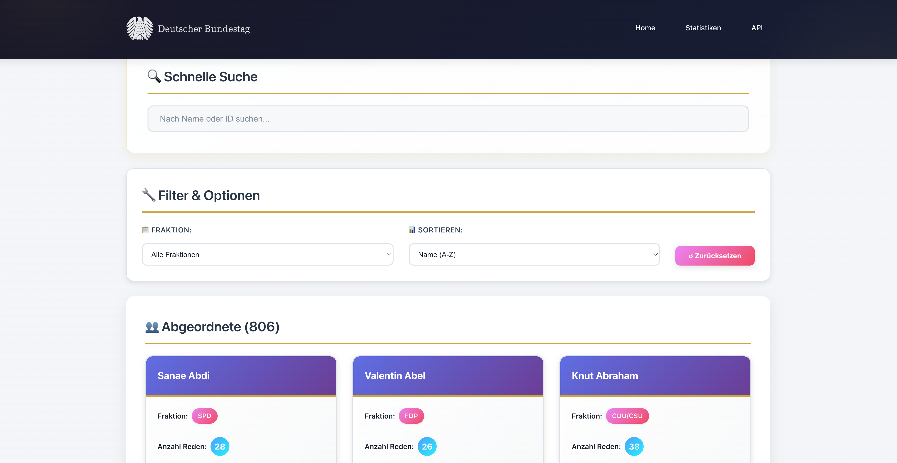
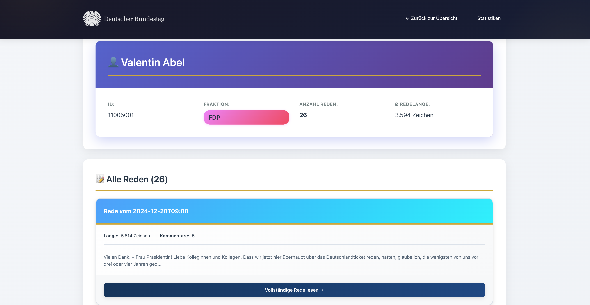
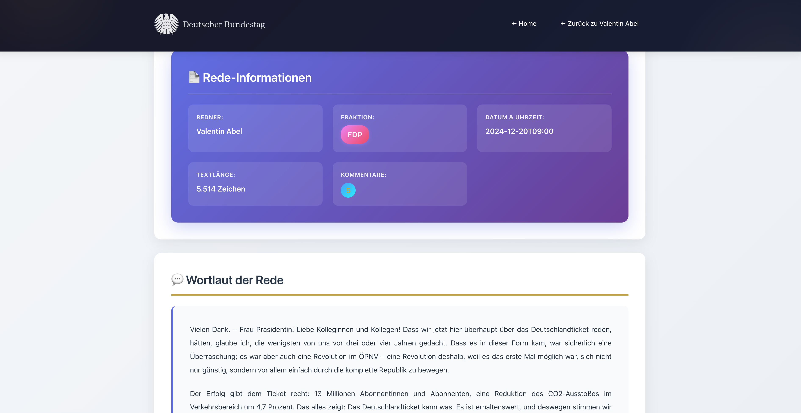
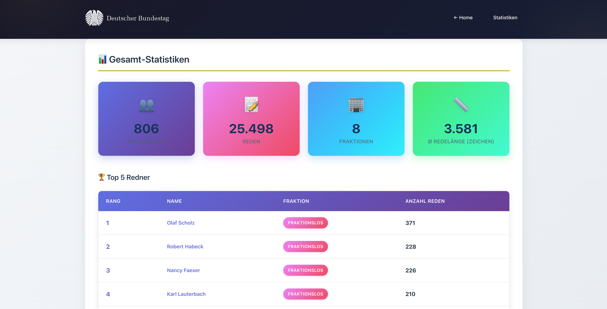
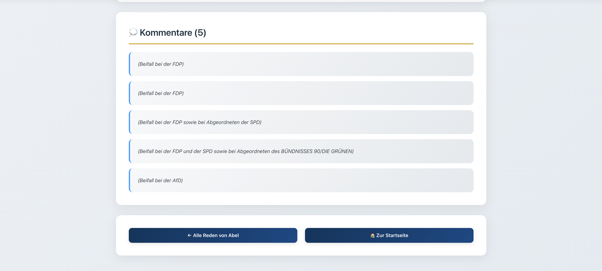

# 🏛️ Bundestag Reden-Portal

Eine webbasierte Anwendung zur Visualisierung, Analyse und Durchsuchung von Bundestagsreden der 20. Wahlperiode mit **Javalin**, **FreeMarker** und **jQuery**.

[](https://openjdk.org/)
[](https://javalin.io/)
[](https://freemarker.apache.org/)
[](https://maven.apache.org/)

---

## 📋 Inhaltsverzeichnis

- [Projektübersicht](#-projektübersicht)
- [Features](#-features)
- [Technologie-Stack](#️-technologie-stack)
- [Installation](#-installation)
- [Verwendung](#-verwendung)
- [Projektstruktur](#-projektstruktur)
- [Screenshots](#-screenshots)
- [Lizenz](#-lizenz)

---

## 🎯 Projektübersicht

Das **Bundestag Reden-Portal** ist eine umfassende Webanwendung zur Aufbereitung und Visualisierung parlamentarischer Daten. Die Applikation macht Bundestagsreden zugänglich, durchsuchbar und analysierbar.

### Hauptziele

- ✅ Vollständige Webvisualisierung von Bundestagsprotokollen
- ✅ Leistungsfähige Such- und Filterfunktionen
- ✅ Umfassende statistische Auswertungen
- ✅ RESTful API für programmatischen Zugriff
- ✅ Responsive und barrierefreies Design

---

## ✨ Features

### 🔍 Kernfunktionalität

- **Live-Suche**: Echtzeit-Suche nach Abgeordneten mit Auto-Suggest
- **Detailansichten**:
  - Abgeordneten-Profile mit allen Reden
  - Volltext-Ansicht einzelner Reden mit Metadaten
  - Kommentare zu Reden
- **Filter & Sortierung**:
  - Nach Fraktion filtern
  - Nach Name (A-Z) sortieren
  - Nach Anzahl der Reden sortieren
- **Statistik-Dashboard**:
  - Gesamtübersicht (Abgeordnete, Reden, Fraktionen)
  - Top-Redner Rankings
  - Fraktions-Vergleiche
  - Durchschnittliche Redelängen

### 🌐 Web-Technologien

- **Server-Side Rendering** mit FreeMarker
- **AJAX-basierte Suche** mit jQuery
- **Responsive Design** für mobile Geräte
- **RESTful API** für Datenabfragen

---

## 🛠️ Technologie-Stack

### Backend

| Technologie | Version | Verwendung |
|------------|---------|------------|
| **Java** | 21 | Programmiersprache |
| **Maven** | 3.8+ | Build-Management |
| **Javalin** | 6.7.0 | Web-Framework |
| **FreeMarker** | 2.3.34 | Template Engine |
| **JSON** | 20250517 | REST-API Format |
| **SLF4J** | 2.0.16 | Logging |

### Frontend

- **HTML5/CSS3** - Markup & Styling
- **JavaScript ES6** - Client-seitige Logik
- **jQuery 3.6.0** - AJAX & DOM-Manipulation

### Architektur-Patterns

- **MVC (Model-View-Controller)**
- **Repository Pattern**
- **Factory Pattern**
- **Service Layer Pattern**

---

## 📦 Installation

### Voraussetzungen

- **Java 21** oder höher
- **Maven 3.8+**
- Optional: Git für Version Control

### Schritt 1: Repository klonen

```bash
git clone https://github.com/parsa-aminian-dev/Bundestagsverwaltungssystem.git
cd Bundestagsverwaltungssystem
```

### Schritt 2: Projekt bauen

```bash
mvn clean package
```

Dies erstellt eine ausführbare JAR-Datei unter `target/Uebung3-1.0.jar`.

### Schritt 3: Anwendung starten

**Mit XML-Daten:**
```bash
java -jar target/Uebung3-1.0.jar /pfad/zu/xml-dateien
```

**Ohne Daten (leere Datenbank):**
```bash
java -jar target/Uebung3-1.0.jar
```

### Schritt 4: Im Browser öffnen

```
http://localhost:7070
```

---

## 💻 Verwendung

### Startseite

Die Startseite bietet:
- **Suchleiste**: Namen eingeben (z.B. "Scholz")
- **Filter**: Fraktion aus Dropdown wählen
- **Sortierung**: Nach Name oder Redeanzahl
- **Abgeordneten-Karten**: Auf "Details ansehen" klicken

### Abgeordneten-Profil

Zeigt für jeden Abgeordneten:
- Persönliche Informationen (Name, Fraktion)
- Anzahl der gehaltenen Reden
- Durchschnittliche Redelänge
- Liste aller Reden mit Vorschau

### Rede-Detailansicht

Jede Rede enthält:
- Vollständiger Redetext
- Datum und Uhrzeit
- Zugehöriger Tagesordnungspunkt
- Alle Kommentare (Zwischenrufe)

### API-Endpunkte

Die Anwendung bietet eine RESTful API:

- `GET /api/abgeordnete` - Alle Abgeordneten
- `GET /api/abgeordnete/search?q={query}` - Suche
- `GET /api/abgeordneter/{id}` - Einzelner Abgeordneter
- `GET /api/reden` - Alle Reden
- `GET /api/rede/{id}` - Einzelne Rede
- `GET /api/statistiken` - Statistiken

---

## 📁 Projektstruktur

```
bundestag-reden-portal/
├── pom.xml                           # Maven Konfiguration
├── README.md                         # Dokumentation
├── LICENSE                           # Lizenz
├── .gitignore                        # Git Ignore
│
├── Doc/                              # Dokumentation & UML
├── screenshots/                      # Screenshots
│
└── src/
    ├── main/
    │   ├── java/de/uni/ppr/uebung3/
    │   │   ├── app/                  # Hauptklasse
    │   │   ├── rest/                 # REST-Handler & Config
    │   │   ├── service/              # Business Logic
    │   │   ├── factory/              # Factory & Repositories
    │   │   ├── model/                # Datenmodelle
    │   │   └── database/             # Neo4j Connection
    │   │
    │   └── resources/
    │       ├── config.properties     # Konfiguration
    │       ├── templates/            # FreeMarker Templates
    │       ├── static/               # CSS, JS, Images
    │       └── Bundestag20/          # XML-Protokolle
    │
    └── test/                         # Unit Tests
```

---

## 📸 Screenshots

### Startseite


### Abgeordneten-Profil


### Rede-Detailansicht


### Statistik-Dashboard


---

## ⚙️ Konfiguration

Die Konfiguration erfolgt über `src/main/resources/config.properties`:

```properties
server.port=7070
server.host=localhost
template.path=/templates
template.cache=false
static.path=/static
app.name=Bundestag Reden-Portal
app.version=1.0
```

**Custom Port:**
```bash
java -Dserver.port=8080 -jar target/Uebung3-1.0.jar
```

---

## 🛠️ Entwicklung

### Projekt kompilieren
```bash
mvn clean compile
```

### Tests ausführen
```bash
mvn test
```

### Im Development-Modus starten
```bash
mvn exec:java
```

### JavaDoc generieren
```bash
mvn javadoc:javadoc
```
Ausgabe: `target/site/apidocs/index.html`

---

## 📄 Lizenz

Dieses Projekt wurde im Rahmen des Programmierpraktikums (PPR) an der Goethe-Universität Frankfurt erstellt.

**Autor:** Parsa Aminian  
**Organisation:** Goethe University Frankfurt / Texttechnology Lab  
**Jahr:** 2025

---

## 🤝 Kontakt

Bei Fragen oder Anregungen:
- Email: parsaaminian8080@gmail.com
- GitHub: [@parsa-aminian-dev](https://github.com/parsa-aminian-dev)
- Repository: [Bundestagsverwaltungssystem](https://github.com/parsa-aminian-dev/Bundestagsverwaltungssystem)

---

**Made with ❤️ for transparent democracy**


---

## 💻 Verwendung

### Startseite

Die Startseite bietet:
- **Suchleiste**: Tippen Sie einen Namen ein (z.B. "Scholz")
- **Filter**: Wählen Sie eine Fraktion aus dem Dropdown
- **Sortierung**: Nach Name (A-Z) oder Anzahl der Reden
- **Abgeordneten-Karten**: Klicken Sie auf "Details ansehen"

### Abgeordneten-Profil

Für jeden Abgeordneten sehen Sie:
- Persönliche Informationen (Name, Fraktion)
- Anzahl der gehaltenen Reden
- Durchschnittliche Redelänge
- Liste aller Reden mit Vorschau

### Rede-Detailansicht

Jede Rede zeigt:
- Vollständiger Redetext
- Datum und Uhrzeit
- Zugehöriger Tagesordnungspunkt
- Alle Kommentare (Zwischenrufe)
- Länge in Zeichen

### Statistik-Dashboard

Das Dashboard präsentiert:
- **Übersichtskarten**: Gesamtzahlen auf einen Blick
- **Top 5 Redner**: Ranking nach Redeanzahl
- **Fraktions-Vergleich**: Mitglieder, Reden, Durchschnitte
- **Visualisierungen**: Tabellen und Statistiken

---

## 📁 Projektstruktur
```
Uebung3/
│
├── pom.xml                                      # Maven Build-Konfiguration
├── README.md                                    # Diese Datei
├── .gitignore                                   # Git Ignore-Regeln
│
├── diagrams/                                    # UML-Diagramme (Aufgabe 1)
│   ├── use-case-diagramm.png
│   ├── klassendiagramm.png
│   └── package-diagramm.png
│
├── screenshots/                                 # Screenshots für Dokumentation
│   ├── startseite.png
│   ├── abgeordneten-profil.png
│   ├── rede-detail.png
│   └── statistiken.png
│
└── src/
    ├── main/
    │   ├── java/de/uni/ppr/uebung3/
    │   │   │
    │   │   ├── app/
    │   │   │   └── Main.java                   # Einstiegspunkt der Anwendung
    │   │   │
    │   │   ├── rest/
    │   │   │   ├── RESTHandler.java            # REST-Routen & HTML-Rendering
    │   │   │   └── RestConfig.java             # Konfigurationsklasse (extends Properties)
    │   │   │
    │   │   ├── service/
    │   │   │   ├── AbgeordnetenService.java    # Business Logic für Abgeordnete
    │   │   │   ├── RedenService.java           # Business Logic für Reden
    │   │   │   └── StatistikService.java       # Statistische Auswertungen
    │   │   │
    │   │   ├── factory/
    │   │   │   ├── RedenPortalFactory.java     # Factory Pattern (aus Übung 2)
    │   │   │   ├── Repository.java             # Repository Interface
    │   │   │   ├── InMemoryRepository.java     # In-Memory Implementierung
    │   │   │   ├── AbgeordneterRepository.java
    │   │   │   ├── FraktionRepository.java
    │   │   │   ├── SitzungRepository.java
    │   │   │   ├── RedeRepository.java
    │   │   │   ├── TOPRepository.java
    │   │   │   └── KommentarRepository.java
    │   │   │
    │   │   ├── model/
    │   │   │   ├── Entity.java                 # Abstrakte Basisklasse
    │   │   │   ├── Abgeordneter.java           # Modell für Abgeordnete
    │   │   │   ├── Fraktion.java               # Modell für Fraktionen
    │   │   │   ├── Sitzung.java                # Modell für Sitzungen
    │   │   │   ├── Tagesordnungspunkt.java     # Modell für TOPs
    │   │   │   ├── Rede.java                   # Modell für Reden
    │   │   │   └── Kommentar.java              # Modell für Kommentare
    │   │   │
    │   │   └── loader/
    │   │       └── XmlProtokollLoader.java     # XML-Parser (aus Übung 2)
    │   │
    │   └── resources/
    │       │
    │       ├── config.properties               # Server-Konfiguration
    │       │
    │       ├── templates/                      # FreeMarker-Templates
    │       │   ├── index.ftl                   # Startseite
    │       │   ├── abgeordneter.ftl            # Abgeordneten-Profil
    │       │   ├── rede.ftl                    # Rede-Detailansicht
    │       │   └── statistiken.ftl             # Statistik-Dashboard
    │       │
    │       └── static/                         # Statische Ressourcen
    │           ├── css/
    │           │   └── style.css               # Haupt-Stylesheet
    │           ├── js/
    │           │   └── main.js                 # JavaScript (jQuery)
    │           └── images/
    │               └── logo.png
    │
    └── test/
        └── java/de/uni/ppr/uebung3/
            ├── service/
            ...


```


### jQuery-Integration

#### Live-Suche
```javascript
$('#searchInput').on('input', function() {
    const query = $(this).val();
    
    $.ajax({
        url: '/api/abgeordnete/search',
        data: { q: query },
        success: function(data) {
            displayResults(data);
        }
    });
});
```

#### Dynamisches Laden
```javascript
$.get('/api/statistiken', function(data) {
    updateStatistics(data);
});
```

### CSS-Features

- **CSS Grid** für Layout
- **Flexbox** für flexible Komponenten
- **CSS Variables** für Theming
- **Media Queries** für Responsive Design
- **CSS Animations** für Übergänge

---

## 📊 Statistiken & Analytics

### Verfügbare Metriken

1. **Grundzahlen**
    - Anzahl Abgeordnete
    - Anzahl Reden
    - Anzahl Fraktionen

2. **Durchschnittswerte**
    - Durchschnittliche Redelänge (gesamt)
    - Durchschnittliche Redelänge pro Abgeordnetem
    - Durchschnittliche Redelänge pro Fraktion
    - Durchschnittliche Reden pro Abgeordnetem

3. **Rankings**
    - Top-Redner nach Anzahl
    - Längste Reden
    - Aktivste Fraktionen

4. **Fraktions-Analysen**
    - Mitgliederzahl
    - Gesamt-Reden
    - Durchschnitt pro Mitglied

---

## 📸 Screenshots

### Startseite

*Übersicht aller Abgeordneten mit Such- und Filterfunktion*

### Abgeordneten-Profil

*Detailansicht mit allen Reden eines Abgeordneten*

### Rede-Detailansicht


*Volltext einer Rede mit Metadaten und Kommentaren*

### Statistik-Dashboard

*Umfassende Statistiken und Rankings*

---

## ⚙️ Konfiguration

### config.properties
```properties
# Server-Konfiguration
server.port=7070
server.host=localhost

# Template-Engine
template.path=/templates
template.cache=false

# Static Files
static.path=/static


app.name=Bundestag Reden-Portal
app.version=1.0


database.path=data/neo4j
```

### Umgebungsvariablen
```bash
export SERVER_PORT=8080
export TEMPLATE_CACHE=true
```

### Custom Port starten
```bash
java -jar target/Uebung3-1.0.jar -Dserver.port=8080
```

---

## 👨‍💻 Entwicklung

### Projekt kompilieren
```bash
mvn clean compile
```

### Tests ausführen
```bash
mvn test
```

### JavaDoc generieren
```bash
mvn javadoc:javadoc
```

Ausgabe: `target/site/apidocs/index.html`

### Code-Style

Das Projekt folgt den [Google Java Style Guide](https://google.github.io/styleguide/javaguide.html) Konventionen.

### Git Workflow
```bash
# Feature-Branch erstellen
git checkout -b feature/neue-funktion

# Änderungen committen
git add .
git commit -m "feat: Neue Suchfunktion implementiert"

# Pushen
git push origin feature/neue-funktion

# Merge Request erstellen
```

---


